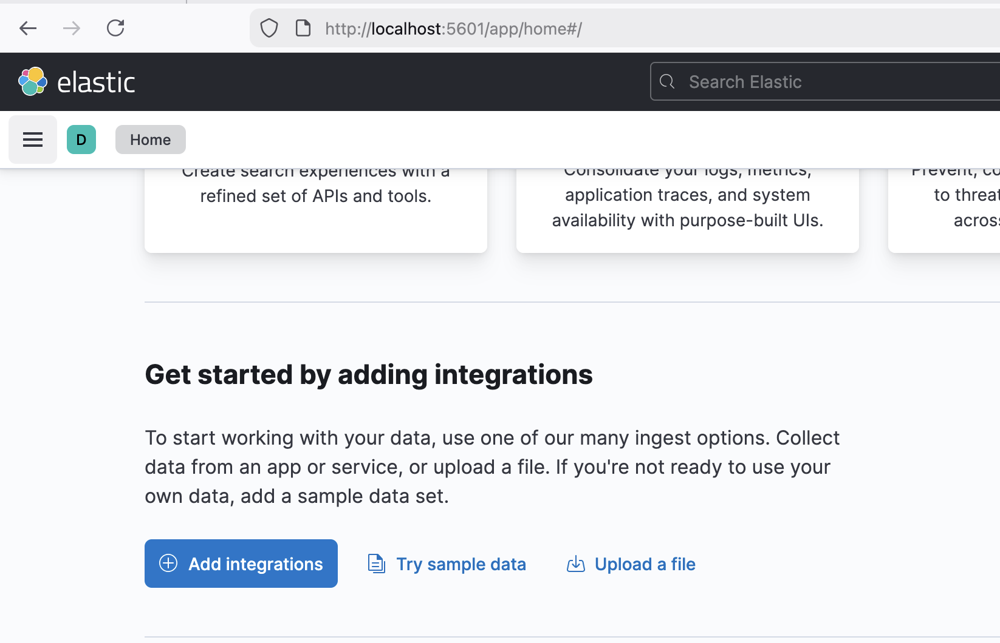

To run backend:

1. pip install -r requirements.txt
2. docker compose up -d
3. go to kibana and import data from /data (home page -> upload a file)

4. run python3 app.py

5. go to localhost:5000/covid_starost to get data for last 7 days (to be changed)
6. go to localhost:5000/covid_regije to get data for last 7 days (to be changed)
